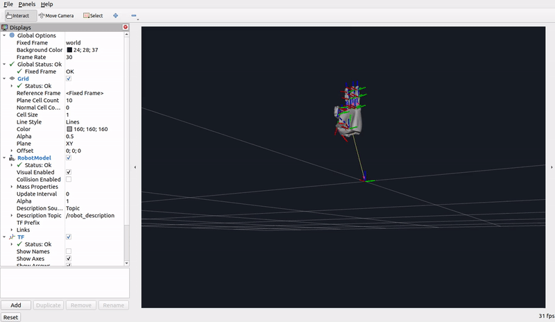

# Robotic-Hand-Simulation-in-ROS2
A ROS-based simulation of a robotic hand featuring full finger articulation and wrist rotation, designed for digital twin visualization in RViz.

---

# 🤖 ROS 2 Robotic Hand Simulation (Digital Twin)


### 🎥 Simulation Motion Preview



## 📖 Overview
This package contains a high-fidelity **ROS 2 simulation of the DexHand V2 robotic hand**, featuring full finger articulation and **wrist rotation**. 

It is designed to act as a **Digital Twin**, allowing you to visualize and control the hand's orientation in 3D Cartesian space using RViz2 and GUI sliders.

---

## ⚙️ Prerequisites
* **ROS 2** (Humble, Iron, or Foxy)
* **Colcon** build system
* **Python 3**

---

## 📥 Installation & Setup

### 1. Create a Workspace (if you haven't already)
```bash
mkdir -p ~/Hand_Sim/src
cd ~/Hand_Sim/src

```

### 2. Clone the Repositories

You need both this control package and the official **DexHand V2 description** repository (for the URDF and mesh files):

```bash
# 1. Clone this simulation/control package
git clone [https://github.com/paneendrakumar0/Robotic-Hand-Simulation-in-ROS2.git](https://github.com/paneendrakumar0/Robotic-Hand-Simulation-in-ROS2.git)

# 2. Clone the DexHand V2 description package (Required for visual model)
git clone [https://github.com/iotdesignshop/dexhandv2_description.git](https://github.com/iotdesignshop/dexhandv2_description.git)

```

### 3. Install Dependencies

```bash
cd ~/Hand_Sim
rosdep install --from-paths src --ignore-src -r -y

```

### 4. Build the Package

```bash
cd ~/Hand_Sim
colcon build --symlink-install
source install/setup.bash

```

---

## 🚀 Usage & Modes

This package supports multiple execution modes:

### 1. High-Fidelity Demo Mode (No Camera Required)
Plays an automated, continuous range-of-motion demonstration loop (fist clenching, waving, sequential finger counting, and thumbs-up) with wrist translations/rotations. Perfect for system verification and presentations.
```bash
ros2 launch dexhand_control advanced_control.launch.py mode:=demo
```

### 2. Camera Hand Tracking Mode (MediaPipe)
Uses your webcam to track your hand gestures and wrist roll dynamically, mirroring them onto the digital twin in real time.
```bash
ros2 launch dexhand_control advanced_control.launch.py mode:=camera
```

---

## 🎮 Out-of-the-Box RViz2 Visualization

This package includes a **pre-configured RViz2 layout** (`config/dexhand.rviz`). When you run the launch file:
* The Fixed Frame is automatically set to `world` (to visualize free-space movements relative to the grid).
* The `RobotModel` and `TF` displays are pre-loaded and configured.
* A high-contrast dark background theme is loaded for a premium visualization aesthetic.

No manual display setup or frame configuration is required!

---

## 📂 File Structure

* `dexhand_control/` - Python controller logic (featuring OneEuro filter smoothing and dynamic demo/camera modes).
* `launch/` - ROS 2 launch files (`advanced_control.launch.py`).
* `config/` - Pre-configured RViz2 configuration (`dexhand.rviz`).
* `resource/` - ROS 2 package resources.
* `setup.py` - Installation and entry point configurations.

---

## 🤝 Contributing

Contributions are welcome! Please fork the repository and submit a pull request.

## 📞 Contact

* **Developer:** Paneendra Kumar
* **Email:** paneendra100@gmail.com

```

```
